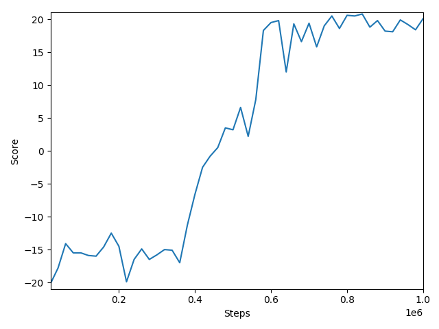

# Pong
## Environment
Application of different Reinforcment Learning algorithms on the Atari game Pong.

* A2C is a synchronous variant of the A3C algorithm (https://arxiv.org/pdf/1708.05144)

* PPO (https://arxiv.org/abs/1707.06347)

## Results
### Reinforce 
#### Fully Connected

#### LSTM

### A2C

### PPO

