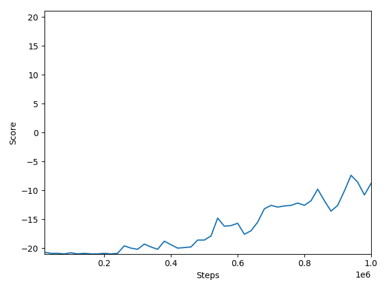

# Pong
## Environment
Application of the Reinforce and A2C algorithm on the Atari game Pong.
A2C is a synchronous variant of the A3C algorithm (https://arxiv.org/pdf/1708.05144.pdf). 

## Results
### Reinforce

### A2C

